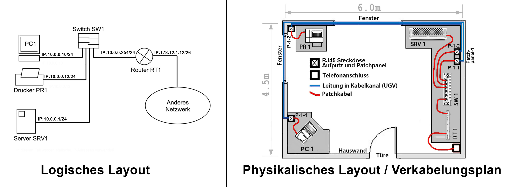

# Arbeitsheft Stefan Laux
- [Netzwerkverkabelung](#netzwerkverkabelung)

-----------------------------------------------------------------------
# Netzwerkverkabelung
### Kursunterlagen: 
- [Webseite von Herr Arnold](https://www.juergarnold.ch/netzwerkverkabelung.html)
- [GitLab Unterlagen zu M117](https://gitlab.com/ch-tbz-it/Stud/m117/-/tree/main/Unterlagen/N1)

-----------------------------------------------------------------------

## Netzwekverbindungen

### Simplex:
Man kann nur senden oder Empfangen nur eine Richtung.

Beispiel: Antenne und Fernsehr
### Halfduplex:
Man kann in beide Richtungen senden und empfangen aber nicht gleichzeitig wenn jemand sendet dann kann das andere ende nur empfangen.

Beispiel: Walkie Talkie
### Duplex:
Man kann gleichzeitig in alle Richtungen senden und empfangen.

Beispiel: Computer - Server

-----------------------------------------------------------------------

## Netzwerktopologie

Die Topologie bezeichnet bei einem Computernetz die Struktur der Verbindungen mehrerer Geräte untereinander, um einen gemeinsamen Datenaustausch zu gewährleisten.

Eine solche Topologie zeigt auf welche Computer miteinander verbundenen ist und über welche Switch die verbindung geht.

-----------------------------------------------------------------------

## Ethernetkabel
### Draht:
- Starr, bricht bei mehrmaligem Biegen und muss darum in einem Kabelkanal geführt (fixiert) verlegt werden.
- Billiger in der Produktion.
- Vorteile dank Stabilität beim Verlegen (Durchstossen) durch Kabelkanäle.
Lässt sich nicht crimpen (Siehe RJ45-Steckerherstellung).
- Kann bei Steckdosenmontage (Schneidklemmen, Schraubverbindungen) verwendet werden.
- Verwendung in UGV-Verkablungen: Universelle Gebäudeverkabelung = Strukturierte Verkabelung in Gebäuden, Büros etc.

### Litze:
- Flexibel, bricht nicht bei mehrmaligem Biegen und kann darum lose verlegt werden.
- Aufwändigere Produktion (Verseilung) und darum etwas teurer.
- Verlegen durch Kabelkanäle kaum möglich.
- Lässt sich crimpen (Siehe RJ45-Steckerherstellung).
- Kann bei Steckdosenmontage (Schneidklemmen, Schraubverbindungen) nicht verwendet werden.
- Verwendung bei Patch-Kabeln: Verbindung von Steckdose zu Endgerät wie PC/Server oder
- Netzwerkkomponente wie Switch, Router etc.

### Glasfaser:
- Eher starres Medium, wo bei zu engem Biegeradius die Übertragungsleistung leidet (Diffuse Zone) oder das Glas vollständig bricht.
- Billiger in der Produktion aber teuer (Spezialgeräte jenseits von Crimpzangen) in der Endverarbeitung (Steckermontage).
- Eine Lichtverbindung lässt prinzipiell eine hohe Datenübertragung zu, erfordert aber auch eine entsprechend leistungsfähige (schnelle) Elektronik. Darum: Performance ist, wie bei den Kupferverbindungen, vom spezifizierten Ethernetstandard abhängig.

-----------------------------------------------------------------------
## Layout
