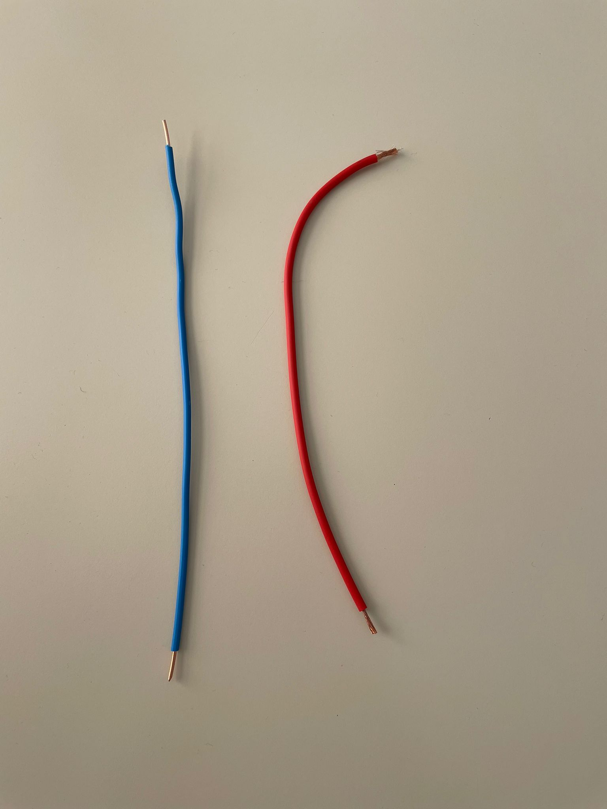
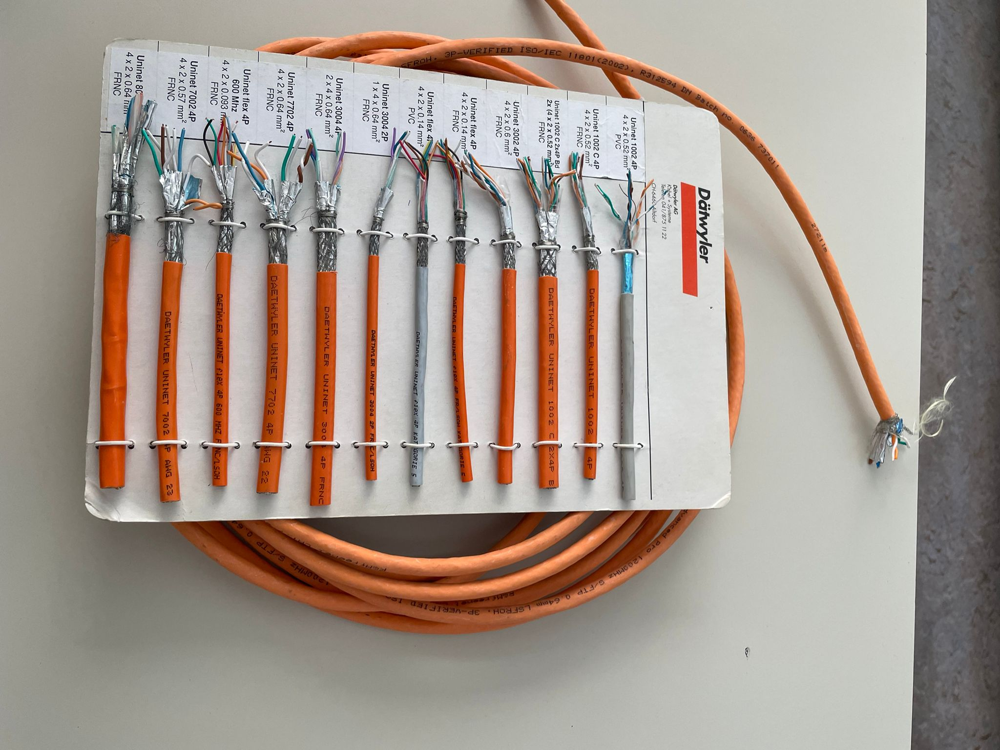
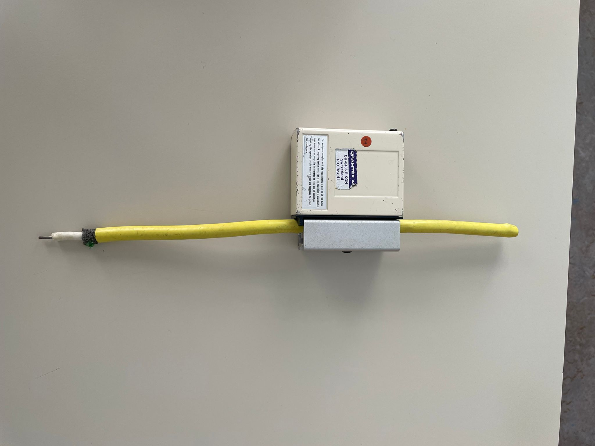
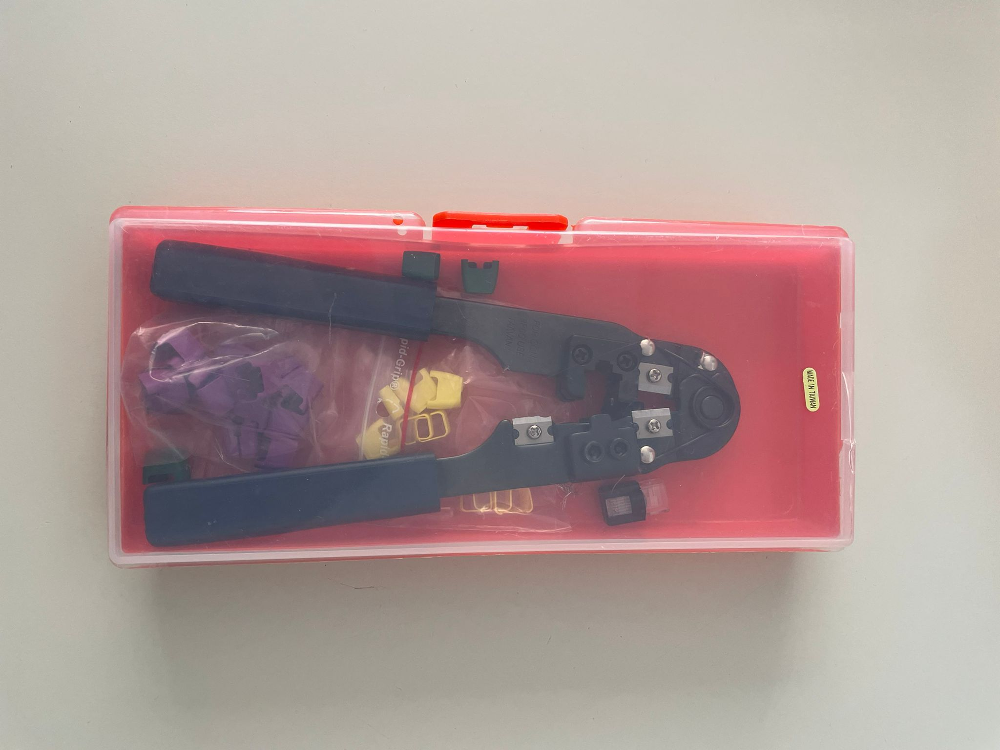
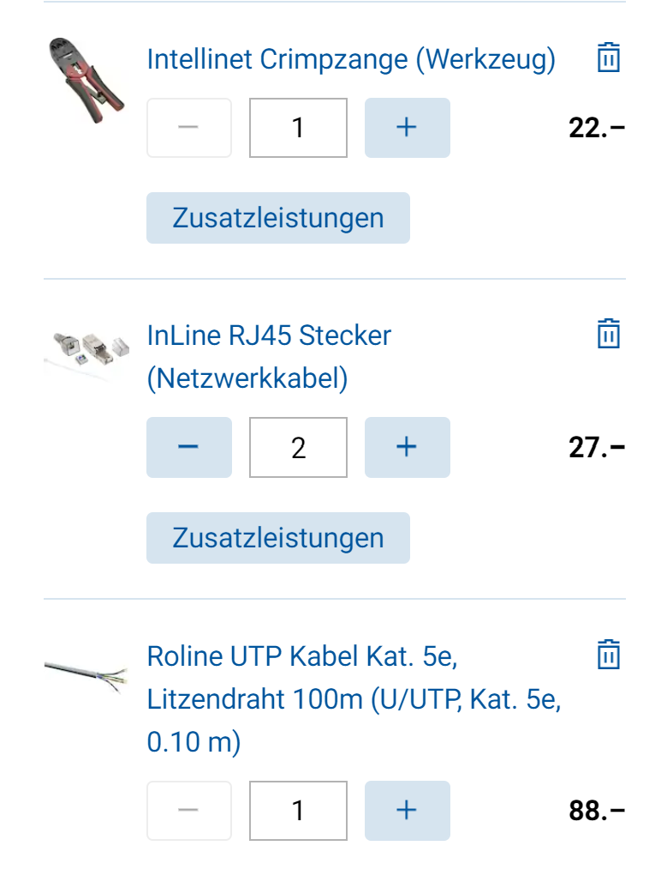

# Aufgaben Netzwerkverkabelung

## Aufgabe 1 Lösungen
- LAN = Local Area Network, Baumtopologie

- Draht wird zur Universellen Gebäudeverkabelung verwendet.
Litze wird als Patch-Kabel verwendet.
Glasfaser wird meist für lange distanzen verwendet und (Server zu Router).

- (Screened/Foiled-TwistedPair) 
  
- Kabel (CAT 5, 5e, 6, 7), RJ45 Stecker, Crimpzange
- Um zwei gleiche Geräte miteinander zu verbinden (PC - PC)
- Netzwerktopologie von zu Hause

--------------------------
## Aufgabe 2 Lösungen

- Blau = Draht-Kabel
- Rot = Litze-Kabel

Normale Ethernet Kabel

Netzwerkkabel mit verschiedenen isolierungen.

Wurde früher verwendet um ein Netzwerk herzustellen. (Baum-Topologie)

Die Crimpzange, ist ein wichtiges Werkzeug zum Kabelschneiden, Abisolieren von Drähten und zum Crimpen von isolierten und nicht isolierten Steckverbindern. 

-----------------------------
## Aufgabe 3 Lösungen

Einkaufsliste um eingenes Kabel herzustellen.

--------------------------------

## Aufgabe 4 Lösungen

